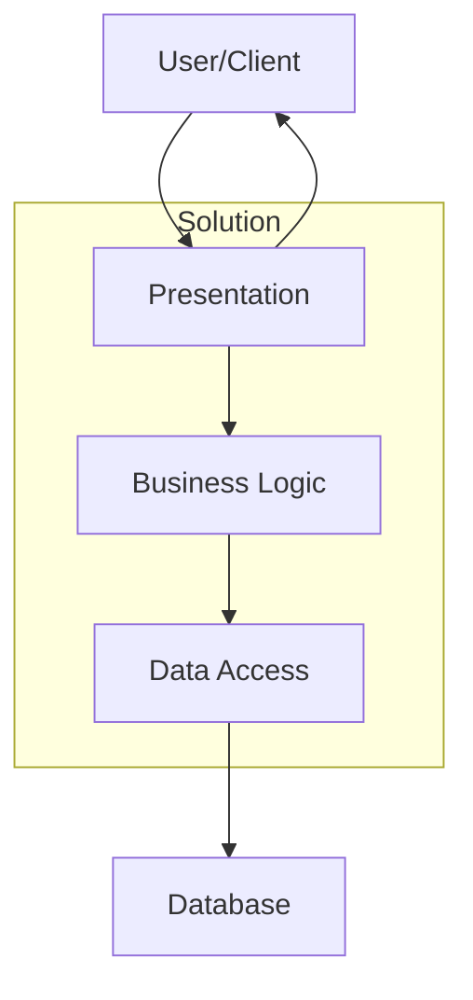
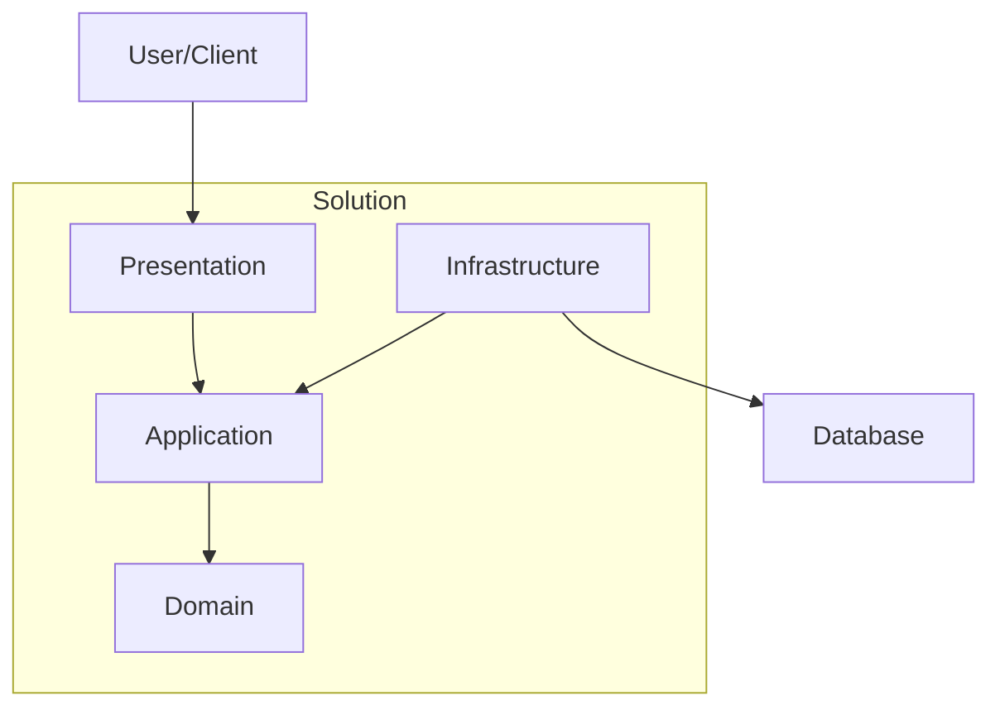

# clean-arch

## N-Tier

Estrutura em camadas: 

- Acoplamento Alto
- Simples

## Clean Architechture

- Camada de dominio não depende das demais
- regras de negócio isoladas
- Complexidade alta
- Baixo acoplamento